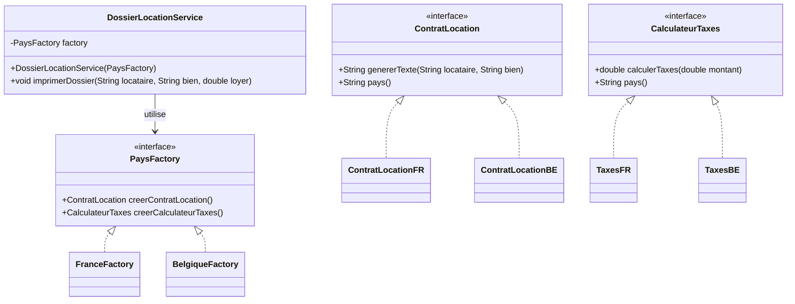
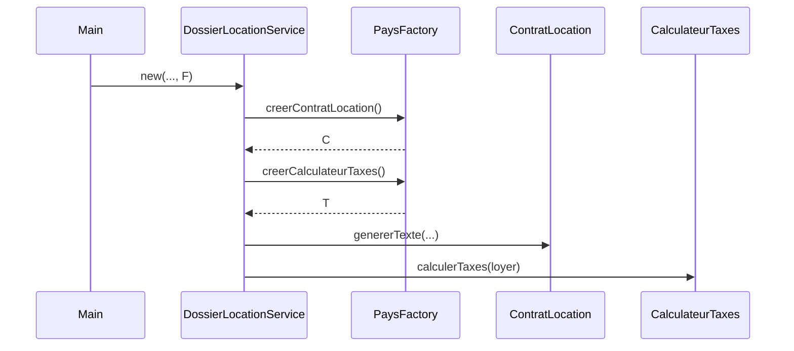

# Abstract Factory

## 🎯 Problème qu’il résout
Quand une application doit créer des objets **liés entre eux** (une “famille”) et que ces objets changent selon un contexte
(ex : pays, marque, thème, environnement…), on se retrouve vite avec :
- des `switch(pays)` dans plein d’endroits,
- des combinaisons incohérentes (ex : contrat France + taxes Belgique),
- un ajout de nouveaux contextes qui impose de modifier beaucoup de code.

## 🧠 Principe de fonctionnement
Abstract Factory fournit une interface de “fabrique” qui sait créer **plusieurs types d’objets** d’une même famille.

Le client :
- choisit une fabrique (ex : `FranceFactory` ou `BelgiqueFactory`)
- demande des objets via des méthodes abstraites (`creerContratLocation()`, `creerCalculateurTaxes()`)
- utilise les interfaces (`ContratLocation`, `CalculateurTaxes`) sans connaître les classes concrètes.

## 🏗 Structure (rôles des classes)
- **AbstractFactory** : `PaysFactory`
- **ConcreteFactories** : `FranceFactory`, `BelgiqueFactory`
- **AbstractProducts** : `ContratLocation`, `CalculateurTaxes`
- **ConcreteProducts** : `ContratLocationFR`, `TaxesFR`, `ContratLocationBE`, `TaxesBE`
- **Client** : `DossierLocationService` (construit un dossier cohérent avec la factory)

## 📈 Avantages
- Garantit la cohérence : objets d’une même famille compatibles entre eux.
- Ajout d’un nouveau pays = ajout d’une nouvelle factory + produits associés (sans casser le client).
- Centralise la création.

## ⚠️ Inconvénients
- Beaucoup de classes/interfaces.
- Ajouter un **nouveau type de produit** (ex : `AssuranceHabitation`) oblige à modifier l’interface de factory et toutes les factories.

## 🧩 Cas d’usage réel possible
- Gestion multi-pays : contrats, taxes, modèles de documents.
- UI multi-thèmes : boutons, menus, fenêtres d’un même style.
- Multi-environnements : connecteurs DB (dev/staging/prod), logs, stockage.

## Structure


## Sequence (création d'un dossier)


---

## 🔧 Commande à exécuter pour l'exemple

```batch
javac AbstractFactoryMethod/src/*.java
java AbstractFactoryMethod/src/Main
```