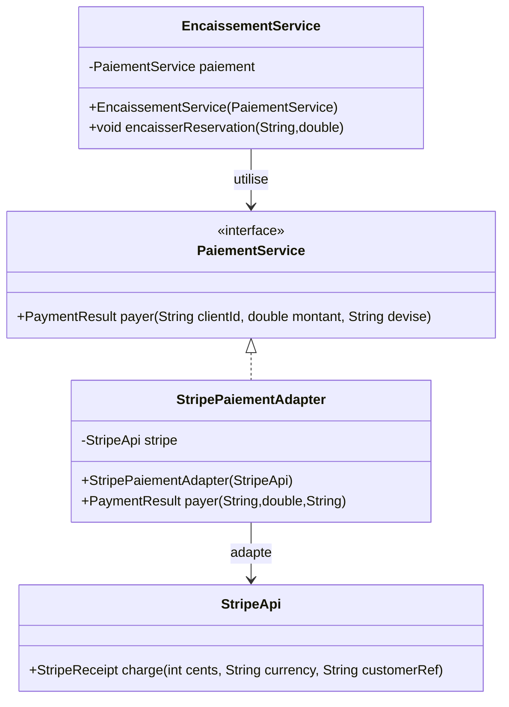
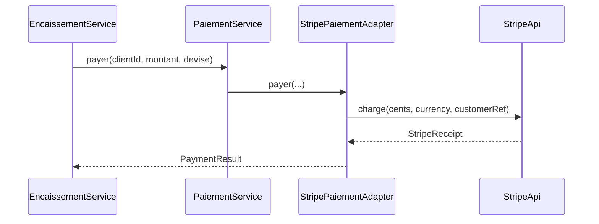

# Adapter

## 🎯 Problème qu’il résout
Quand on veut utiliser une classe existante (souvent une librairie externe) mais que son interface ne correspond pas
à ce que notre application attend, on se retrouve avec :
- du code client rempli de conversions / bricolage,
- une dépendance directe à la lib externe partout,
- une difficulté à changer de prestataire plus tard.

Exemple agence immo :
Notre application veut appeler `PaiementService.payer(...)`.
Mais un prestataire externe expose une API différente (ex : `StripeApi.charge(...)`).

## 🧠 Principe de fonctionnement
Adapter crée une classe “pont” qui :
- implémente l’interface attendue par notre application (`PaiementService`),
- traduit l’appel vers l’API existante (`StripeApi`),
- convertit les données si nécessaire (montant, devise, format…).

Le client ne connaît que l’interface `PaiementService`, pas Stripe.

## 🏗 Structure (rôles des classes)
- **Target** : `PaiementService` (interface attendue par l’app)
- **Adaptee** : `StripeApi` (classe existante incompatible)
- **Adapter** : `StripePaiementAdapter` (traduit Target -> Adaptee)
- **Client** : `EncaissementService` / `Main`

## 📈 Avantages
- Découple ton code métier de la librairie externe.
- Permet de remplacer Stripe par un autre prestataire sans réécrire tout le projet.
- Centralise la conversion et la logique d’intégration.

## ⚠️ Inconvénients
- Ajoute une couche et des classes supplémentaires.
- Si l’API externe change souvent, l’adapter doit être maintenu.

## 🧩 Cas d’usage réel possible
- Paiement (Stripe, PayPal…)
- Géolocalisation (Google Maps, Mapbox…)
- Stockage (S3, Drive…)
- Envoi mail/SMS (SendGrid, Twilio…)

## Structure


## Séquence


---

## 🔧 Commande à exécuter pour l'exemple

```batch
javac Adapter/src/*.java
java Adapter/src/Main
```