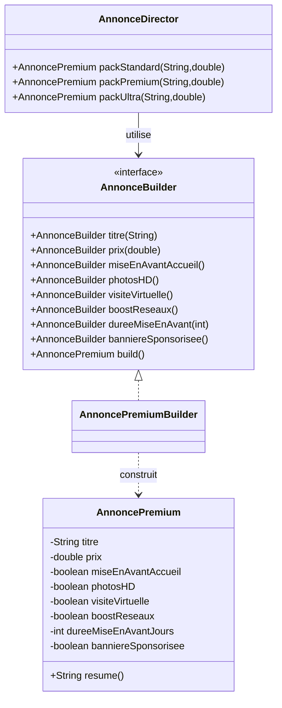
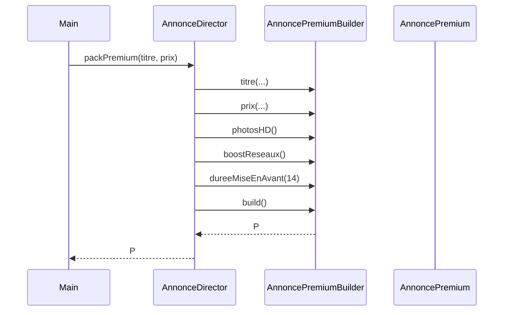

# Builder

## 🎯 Problème qu’il résout
Quand on doit créer un objet complexe avec beaucoup de paramètres (dont une partie optionnelle),
les solutions classiques deviennent vite mauvaises :
- constructeur avec beaucoup d’arguments,
- valeurs `null` / `false` partout,
- plusieurs constructeurs surchargés difficiles à maintenir,
- risque d’inverser l’ordre des paramètres.

## 🧠 Principe de fonctionnement
Builder sépare :
- **la construction** d’un objet
- **de sa représentation finale**

On construit l’objet étape par étape via un `Builder` :
- on définit les champs obligatoires
- puis on ajoute les options souhaitées
- et on termine avec `build()` qui retourne l’objet final

Un **Director** peut être utilisé pour fournir des “recettes” de construction (packs métier).

## 🏗 Structure (rôles des classes)
- **Product** : `AnnoncePremium` (objet final)
- **Builder** : `AnnonceBuilder` (définit les étapes)
- **ConcreteBuilder** : `AnnoncePremiumBuilder` (implémente les étapes et construit le produit)
- **Director** : `AnnonceDirector` (propose des packs : Standard / Premium / Ultra)
- **Client** : `Main` (choisit un pack ou construit manuellement)

## 📈 Avantages
- Code de construction lisible et explicite.
- Plus besoin de passer des `null` pour les champs optionnels.
- Permet de garantir un objet final cohérent (validation dans `build()`).
- Favorise la réutilisation via des “recettes” (Director).

## ⚠️ Inconvénients
- Plus de classes à maintenir.
- Surdimensionné si l’objet est simple ou si les options sont rares.

## 🧩 Cas d’usage réel possible
- Création d’une annonce immo avec options marketing.
- Génération de documents complexes (contrat + annexes).
- Construction de requêtes (filtres optionnels).
- Configuration d’un export (format, colonnes, tri, etc.).

## Structure


## Séquence (pack Premium)


---

## 🔧 Commande à exécuter pour l'exemple

```batch
javac Builder/src/*.java
java Builder/src/Main
```