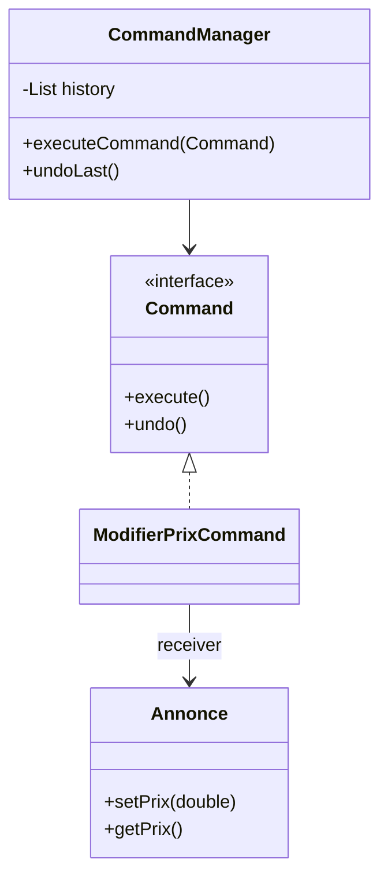

# Command

## 🎯 Problème qu’il résout
Quand on veut encapsuler une action dans un objet, afin de pouvoir :
- l’exécuter plus tard,
- la stocker dans un historique,
- faire undo / redo,
- mettre en file d’attente des actions,
- déclencher des actions sans connaître les détails d’implémentation.

Sans Command, le code est fortement couplé aux méthodes concrètes.

## 🧠 Principe de fonctionnement
Command encapsule une requête sous forme d’objet.

Une Command :
- contient une référence vers un Receiver,
- implémente une méthode `execute()`,
- peut implémenter `undo()`.

L’Invoker déclenche la commande sans connaître la logique métier.

## 🏗 Structure (rôles des classes)
- **Command** : `Command`
- **ConcreteCommand** : `ModifierPrixCommand`
- **Receiver** : `Annonce`
- **Invoker** : `CommandManager`
- **Client** : `Main`

## 📈 Avantages
- Découple l’émetteur de la requête de son exécuteur.
- Permet undo/redo.
- Permet historisation.
- Permet exécution différée ou batch.

## ⚠️ Inconvénients
- Augmente le nombre de classes.
- Complexité supplémentaire pour des actions simples.

## 🧩 Cas d’usage réel possible
- Historique d’actions utilisateur.
- Transactions annulables.
- Files de tâches.
- Macros.

## Mermaid — structure


---

## 🔧 Commande à exécuter pour l'exemple

```batch
javac Command/src/*.java
java Command/src/Main
```