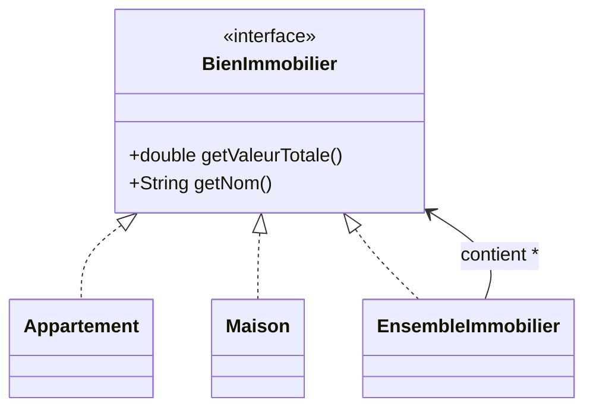

# Composite

## 🎯 Problème qu’il résout
Quand on manipule une structure hiérarchique (arbre), on veut traiter :
- un objet simple
- un groupe d’objets

de la même manière.

Sans Composite, on aurait :
- beaucoup de `instanceof`
- des traitements différents selon le type
- un code fragile et peu extensible

## 🧠 Principe de fonctionnement
On définit une interface commune (Component).
Elle est implémentée par :
- des objets simples (Leaf)
- des objets composés (Composite)

Le Composite contient une collection de Component.
Ainsi, on peut appeler la même méthode sur un objet simple ou un groupe.

## 🏗 Structure (rôles des classes)
- **Component** : `BienImmobilier`
- **Leaf** : `Appartement`, `Maison`
- **Composite** : `EnsembleImmobilier`
- **Client** : `Main`

## 📈 Avantages
- Uniformise le traitement (objet simple ou groupe).
- Supprime les `instanceof`.
- Facilite l’extension (nouveau type de bien).

## ⚠️ Inconvénients
- L’interface commune peut contenir des méthodes non pertinentes pour certaines implémentations.
- Structure parfois plus complexe que nécessaire.

## 🧩 Cas d’usage réel possible
- Biens immobiliers (appartement, immeuble, portefeuille).
- Arborescence de fichiers.
- UI (composant simple / conteneur).
- Organisation hiérarchique (employé / département).

## Mermaid — structure


---

## 🔧 Commande à exécuter pour l'exemple

```batch
javac Composite/src/*.java
java Composite/src/Main
```