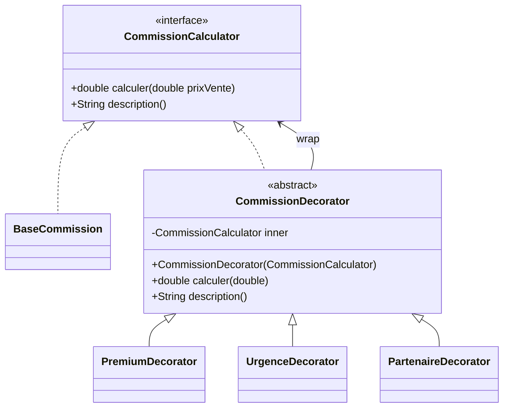
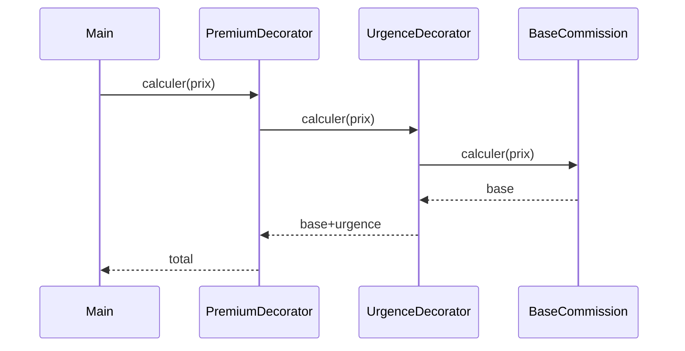

# Decorator

## 🎯 Problème qu’il résout
Quand on veut ajouter des fonctionnalités/options à un objet, on a souvent 2 mauvaises solutions :
- créer plein de sous-classes (explosion combinatoire : Standard, Standard+Premium, Standard+Urgent, etc.)
- mettre des `if` partout avec des flags (code dur à lire et à maintenir)

Decorator permet d’ajouter des responsabilités **dynamiquement** en empilant des “couches”.

## 🧠 Principe de fonctionnement
On part d’un composant de base (ex : commission standard).
Puis on l’enveloppe avec des décorateurs (ex : option urgence, option premium, partenariat…).

Chaque décorateur :
- implémente la même interface que le composant,
- contient une référence vers un autre composant,
- ajoute sa propre logique avant/après l’appel.

## 🏗 Structure (rôles des classes)
- **Component** : `CommissionCalculator`
- **ConcreteComponent** : `BaseCommission`
- **Decorator** : `CommissionDecorator` (abstrait, contient un `CommissionCalculator`)
- **ConcreteDecorators** : `UrgenceDecorator`, `PremiumDecorator`, `PartenaireDecorator`
- **Client** : `Main` (compose les options comme des couches)

## 📈 Avantages
- Ajout d’options sans modifier la classe de base.
- Combine librement les options (empilement).
- Évite l’explosion de sous-classes.

## ⚠️ Inconvénients
- Beaucoup de petits objets (plus de classes).
- Debug parfois moins évident (chaîne de décorateurs).
- L’ordre des décorations peut changer le résultat (il faut le maîtriser).

## 🧩 Cas d’usage réel possible
- Calcul de prix : options, réductions, taxes, suppléments.
- I/O : buffers, compression, chiffrement (ex : streams Java).
- UI : ajout de bordures, scroll, ombres, etc.

## Mermaid — structure


## Séquence (empilement)

  
---

## 🔧 Commande à exécuter pour l'exemple

```batch
javac Decorator/src/*.java
java Decorator/src/Main
```