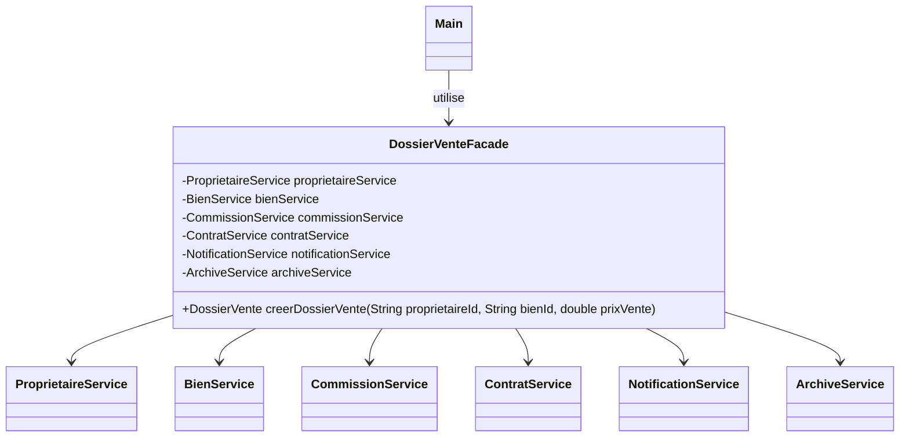
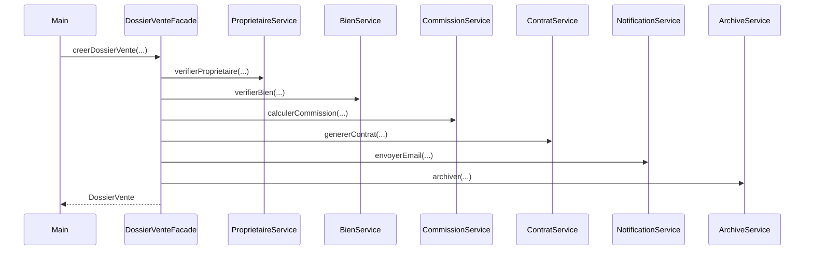

# Facade

## 🎯 Problème qu’il résout
Quand un système est composé de plusieurs services/classes et nécessite un ordre d’appels précis,
le code client devient vite :
- long et répétitif,
- difficile à lire,
- fragile (si l’ordre change, on casse le flux),
- très couplé à plein de classes internes.

Facade propose une interface simple qui masque cette complexité.

## 🧠 Principe de fonctionnement
On crée une classe Façade qui :
- possède/instancie les sous-systèmes (services internes),
- orchestre les appels dans le bon ordre,
- expose au client une méthode simple (ex : `creerDossierVente(...)`).

Le client n’utilise plus directement les services internes.

## 🏗 Structure (rôles des classes)
- **Facade** : `DossierVenteFacade`
- **Sous-systèmes** : `ProprietaireService`, `BienService`, `CommissionService`, `ContratService`, `NotificationService`, `ArchiveService`
- **Client** : `Main` (ou un contrôleur)

## 📈 Avantages
- Simplifie l’utilisation d’un système complexe.
- Réduit le couplage (le client dépend surtout de la façade).
- Centralise un workflow métier (ordre d’exécution).

## ⚠️ Inconvénients
- Peut devenir une “classe fourre-tout” si on y met trop de responsabilités.
- Risque de masquer des besoins de découpage plus propre si mal utilisée.

## 🧩 Cas d’usage réel possible
- Création d’un dossier de vente ou de location (vérifs + calculs + documents + notifications).
- Onboarding d’un nouveau client (création compte + email + CRM).
- Publication d’annonce (validation + SEO + publication + marketing).

## Mermaid — structure


## Séquence


---

## 🔧 Commande à exécuter pour l'exemple

```batch
javac Facade/src/*.java
java Facade/src/Main
```