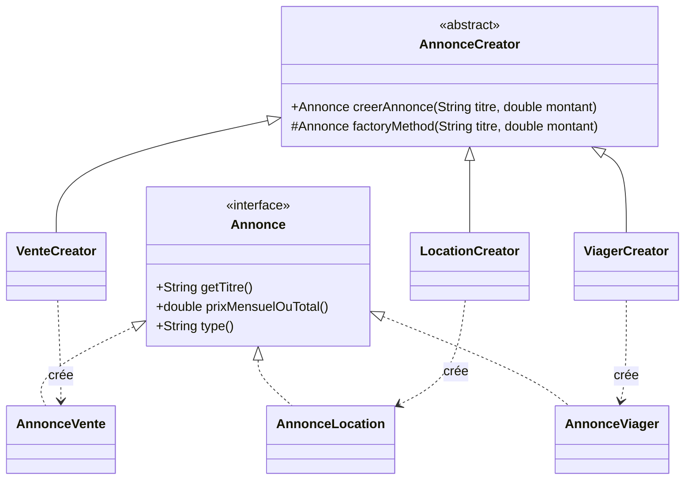
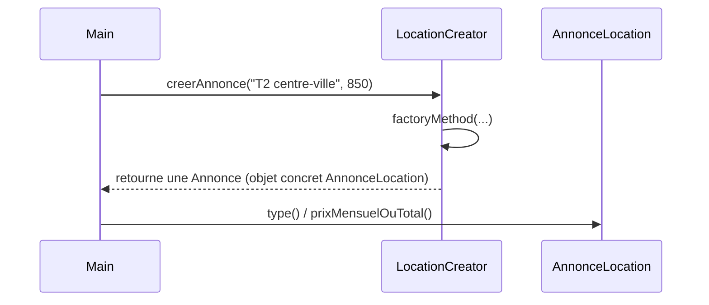

# Factory Method

## 🎯 Problème qu’il résout
Quand un programme doit créer des objets d’une même “famille” (ex : différentes annonces immobilières),
on finit souvent avec :
- des `if/else` ou `switch` partout,
- du code client dépendant directement des classes concrètes (`new VenteAnnonce()`, `new LocationAnnonce()`, etc.),
- une difficulté à ajouter un nouveau type sans toucher à plein d’endroits.

## 🧠 Principe de fonctionnement
Le Factory Method consiste à :
- définir une méthode de création (la “factory method”) dans une classe mère,
- laisser les sous-classes décider quel objet concret créer.

Le code “métier” travaille avec une interface/abstraction (`Annonce`) au lieu de dépendre des classes concrètes.

## 🏗 Structure (rôles des classes)
- **Product** : `Annonce` (interface)
- **ConcreteProducts** : `AnnonceVente`, `AnnonceLocation`, `AnnonceViager`
- **Creator** : `AnnonceCreator` (classe abstraite qui contient la factory method)
- **ConcreteCreators** : `VenteCreator`, `LocationCreator`, `ViagerCreator`
- **Client** : `Main` (ou un service) qui utilise un creator sans connaître la classe exacte de l’annonce créée

## 📈 Avantages
- Réduit le couplage : le client manipule `Annonce`, pas les classes concrètes.
- Facilite l’ajout d’un nouveau type d’annonce (nouvelle classe + nouveau creator).
- Centralise la logique de création.

## ⚠️ Inconvénients
- Augmente le nombre de classes (un creator par type dans la forme “pure”).
- Peut sembler plus lourd que nécessaire pour des cas simples.

## 🧩 Cas d’usage réel possible
Dans une agence immo :
- annonces de vente / location / viager,
- documents (quittance / état des lieux),
- calculs (différents calculateurs de frais selon le type de transaction).

## Structure


## Séquence (création)


---

## 🔧 Commande à exécuter pour l'exemple

```batch
javac Factory/src/*.java
java Factory/src/Main
```