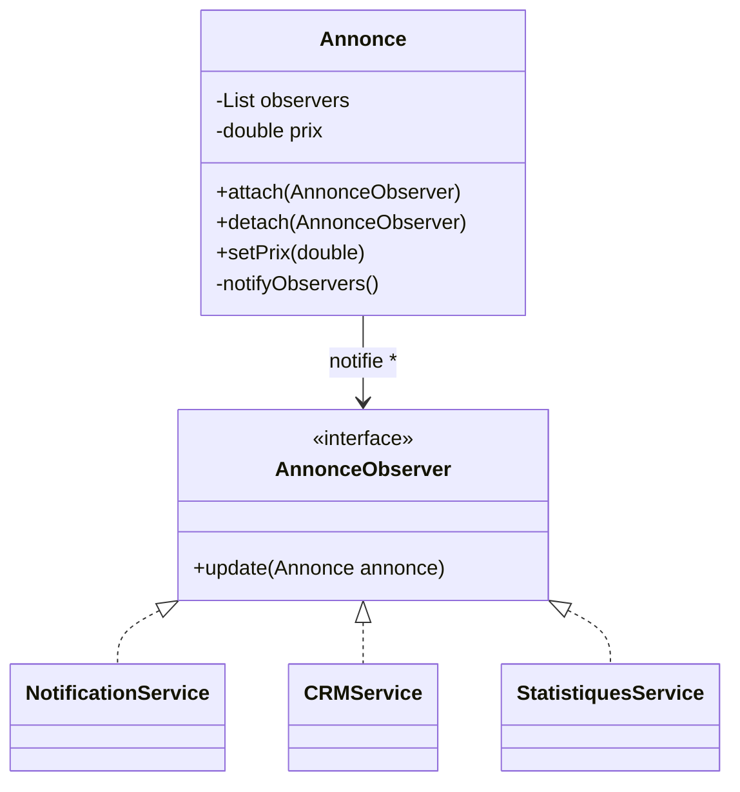

# Observer

## 🎯 Problème qu’il résout
Quand un objet change d’état et que plusieurs autres objets doivent être informés,
on peut facilement tomber dans :
- un fort couplage (le sujet connaît tous les services),
- des appels directs multiples,
- un code difficile à faire évoluer.

Observer permet de notifier automatiquement des objets abonnés,
sans que le sujet connaisse leurs implémentations concrètes.

## 🧠 Principe de fonctionnement
On définit :
- un Subject (Observable)
- une interface Observer

Le Subject :
- maintient une liste d’Observers,
- expose attach() / detach(),
- appelle notifyObservers() lorsqu’un changement important survient.

Les Observers implémentent une méthode update().

## 🏗 Structure (rôles des classes)
- **Subject** : `Annonce`
- **Observer (interface)** : `AnnonceObserver`
- **ConcreteObservers** :
  - `NotificationService`
  - `CRMService`
  - `StatistiquesService`
- **Client** : `Main`

## 📈 Avantages
- Faible couplage entre le sujet et les services.
- Ajout d’un nouvel observer sans modifier le sujet.
- Réagit dynamiquement aux changements.

## ⚠️ Inconvénients
- Difficulté à suivre les enchaînements de notifications.
- Risque de cascade d’événements.
- Peut devenir complexe si beaucoup d’observers.

## 🧩 Cas d’usage réel possible
- Systèmes d’événements.
- Interfaces graphiques.
- Notifications.
- Architecture orientée événements.

## Mermaid — structure


---

## 🔧 Commande à exécuter pour l'exemple

```batch
javac Observer/src/*.java
java Observer/src/Main
```