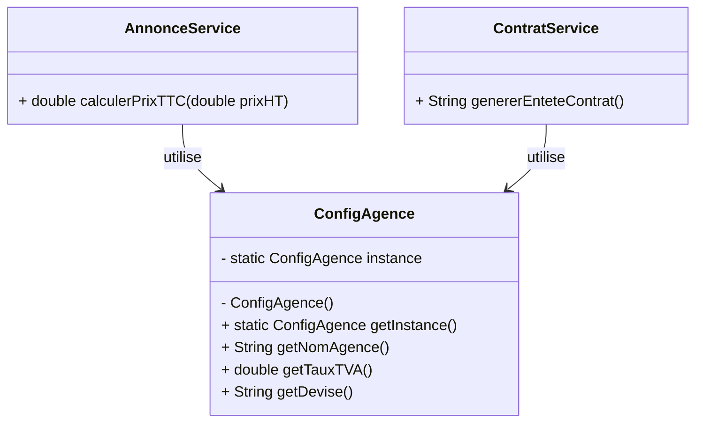
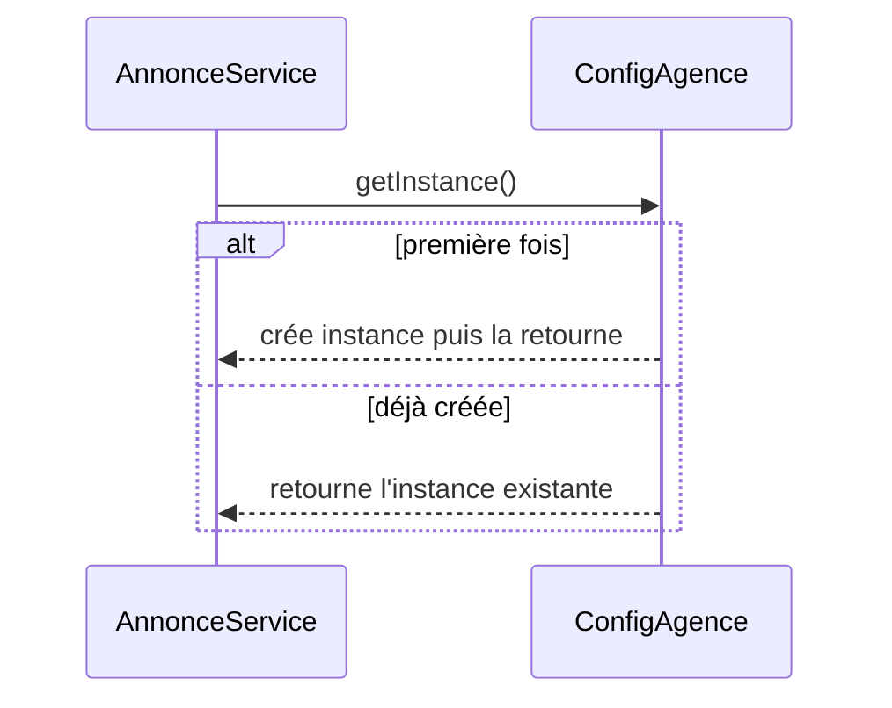

# Singleton

## 🎯 Problème qu’il résout
Dans une application, certaines ressources doivent exister **en un seul exemplaire** (ex : configuration globale).  
Sans règle claire, on risque :
- plusieurs objets “config” différents (valeurs incohérentes),
- du code qui crée la config n’importe où,
- des comportements différents selon l’ordre d’exécution.

## 🧠 Principe de fonctionnement
Le Singleton garantit :
- **une seule instance** d’une classe,
- un **point d’accès global** à cette instance.

L’idée : la classe contrôle elle-même sa création :
- constructeur **privé** (personne ne peut faire `new`),
- méthode statique `getInstance()` (retourne toujours la même instance).

## 🏗 Structure (rôles des classes)
- **Singleton** : la classe qui contient l’unique instance (ici `ConfigAgence`)
- **Clients** : les classes qui utilisent la config (ici `AnnonceService`, `ContratService`, etc.)

## 📈 Avantages
- Garantit une configuration unique et cohérente.
- Accès simple partout dans le code via `getInstance()`.
- Évite de passer la config en paramètre partout.

## ⚠️ Inconvénients
- C’est un **état global** : peut rendre les tests plus difficiles.
- Peut masquer des dépendances (on ne voit plus qui dépend de quoi).
- En multi-thread, il faut une implémentation sûre (sinon double création possible).

## 🧩 Cas d’usage réel possible
- Configuration applicative (nom de l’agence, taux de TVA, devises, chemin d’export PDF…)
- Journalisation (logger)
- Cache global
- Registry/Container (dans certains frameworks)

## Structure


## Séquence (accès à l’instance)


## 🔧 Commande à exécuter pour l'exemple

```batch
javac Singleton/src/*.java
java Singleton/src/Main
```