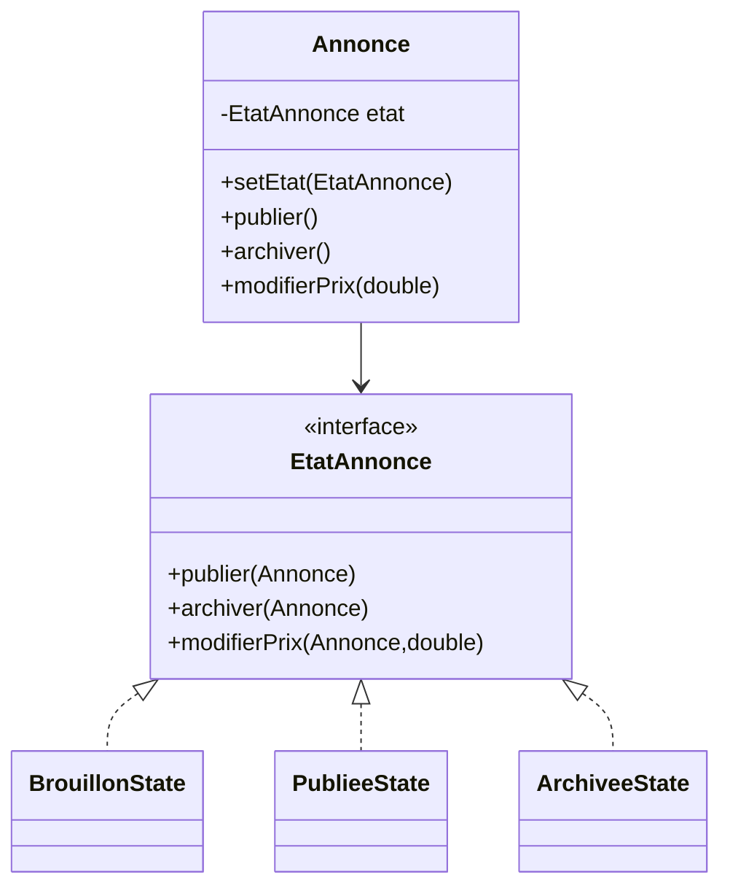

# State

## 📌 Nom du pattern
State

## 🎯 Problème qu’il résout
Quand le comportement d’un objet dépend de son état interne,
on finit souvent avec :
- des `if/else` multiples,
- un code difficile à maintenir,
- des conditions dispersées partout.

State permet d’encapsuler chaque état dans une classe distincte.

## 🧠 Principe de fonctionnement
Le Context contient une référence vers un objet State.

Chaque State :
- définit le comportement pour cet état,
- peut changer l’état du Context.

Le Context délègue les actions à son State courant.

## 🏗 Structure (rôles des classes)
- **Context** : `Annonce`
- **State (interface)** : `EtatAnnonce`
- **ConcreteStates** :
  - `BrouillonState`
  - `PublieeState`
  - `ArchiveeState`
- **Client** : `Main`

## 📈 Avantages
- Supprime les gros `if` liés aux états.
- Facilite l’ajout de nouveaux états.
- Respecte Open/Closed.

## ⚠️ Inconvénients
- Augmente le nombre de classes.
- Les transitions doivent être bien pensées.

## 🧩 Cas d’usage réel possible
- Workflow métier (brouillon → publié → archivé).
- Machine à états.
- Cycle de vie d’un document.

## Mermaid — structure


---

## 🔧 Commande à exécuter pour l'exemple

```batch
javac State/src/*.java
java State/src/Main
```