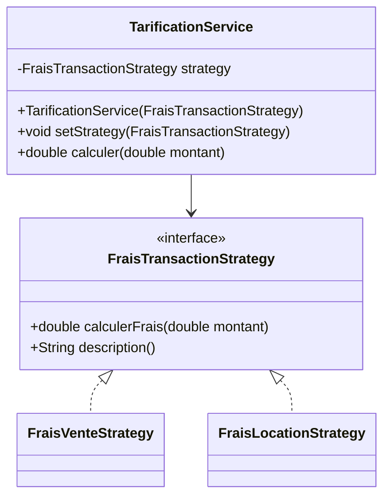

# Strategy

## 🎯 Problème qu’il résout
Quand un même traitement peut avoir plusieurs variantes (algorithmes différents),
on finit souvent avec :
- un gros `if/else` ou `switch`,
- du code difficile à maintenir,
- des modifications fréquentes dès qu’on ajoute une nouvelle règle.

Strategy permet d’encapsuler chaque algorithme dans une classe distincte
et de choisir l’algorithme dynamiquement.

## 🧠 Principe de fonctionnement
On définit une interface commune (Strategy).
Chaque variante d’algorithme l’implémente.
Le Context possède une référence vers une Strategy et délègue le calcul.

On peut changer la Strategy au runtime.

## 🏗 Structure (rôles des classes)
- **Strategy** : `FraisTransactionStrategy`
- **ConcreteStrategies** :
  - `FraisVenteStrategy`
  - `FraisLocationStrategy`
- **Context** : `TarificationService`
- **Client** : `Main`

## 📈 Avantages
- Supprime les gros `switch`.
- Facilite l’ajout d’un nouvel algorithme.
- Respecte le principe Open/Closed.
- Permet un changement dynamique au runtime.

## ⚠️ Inconvénients
- Augmente le nombre de classes.
- Le client doit connaître les stratégies disponibles.

## 🧩 Cas d’usage réel possible
- Calculs de frais selon type de transaction.
- Méthodes de paiement.
- Algorithmes de tri.
- Stratégies de réduction.

## Mermaid — structure


---

## 🔧 Commande à exécuter pour l'exemple

```batch
javac Strategy/src/*.java
java Strategy/src/Main
```